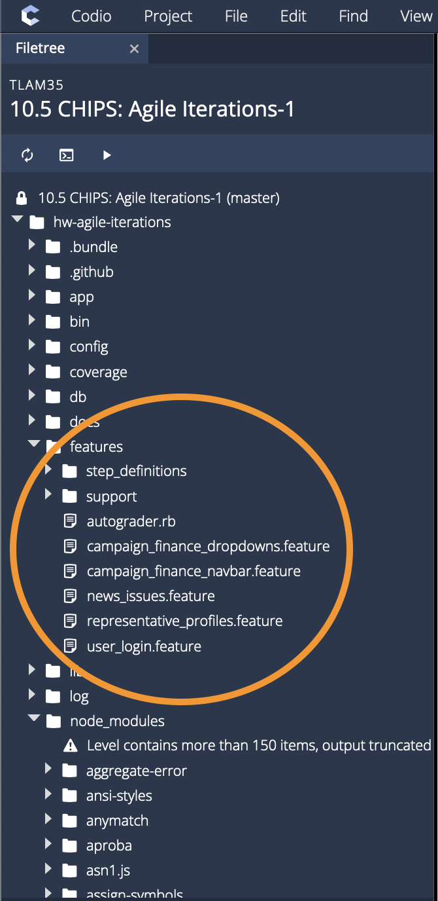
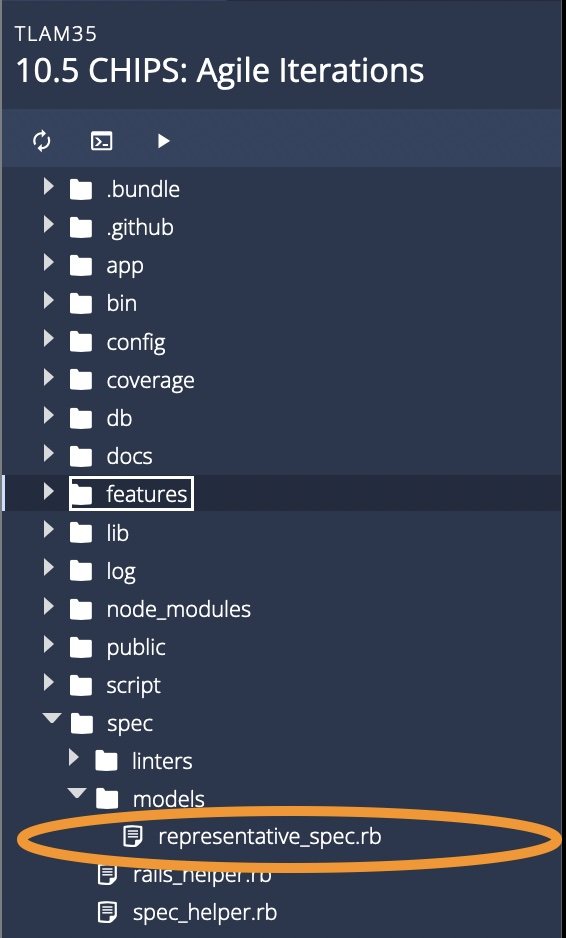

This is a work in progress: It is simply a collection of files that you can paste into Codio until I connect it to the Codio autograder system.

Note that these tests require a fully set-up CHIPS 10.5 with Google API keys, correctly installed modules, etc. It also works on only a solution that I will put up soon as (one of the) canonical solutions? One assumption is tht students have made a navbar for easy navigation across the app (to be honest this should be a requirement)

# Instructions

This repo currently consists of only one folder, `/features`, and one script, `autograder.rb`. 

1. Please copy all of the Cucumber test files into the /features directory in the CHIPS 10.5 Codio/Repository as shown below:

2. Copy `representative_spec.rb` into the `/spec/models` directory as shown below:

3. Replace the `web_steps.rb` file in Codio with the `web_steps.rb`

(Not tested well enough yet--it seems to massively lag Codio for some reason, but it works some of the time)
4. Finally, you may run the autograder by calling `ruby autograder.rb`.

# List of Tests (8):

- Task 1.1: `representative_spec.rb`: An RSpec test regarding Task 1.1: "Fix Legacy Code". (Perhaps this test should be hidden as well? Perhaps hide it through a Codio autograder?)
- Task 1.2: `display_profile.feature`: Representative Profiles
- Task 1.3: `map_actions.feature`: Note that this currently just uses a workaround for the map to make sure at least the county page displays the representatives for a county.
- Task 2.1: `issues_column.feature`: This test cannot run in conjunction wih Option 1, only option 2.
- Task 2.2 (Option 1): `add_news_items.feature`: Adding news items
- Task 2.2 (Option 2): `campaign_finance.feature`
- Extra Tests: `display_representatives.feature`, `account_login.feature`

# TODO:
- Figure out how to work Selenium and/or ChromeDriver for Part 2 tests (Currently Blocking)
- Find out some way to get the map to be clickable through Cucumber (or click it through a web driver?)
- Some sort of canonical application that would receive full credit.
